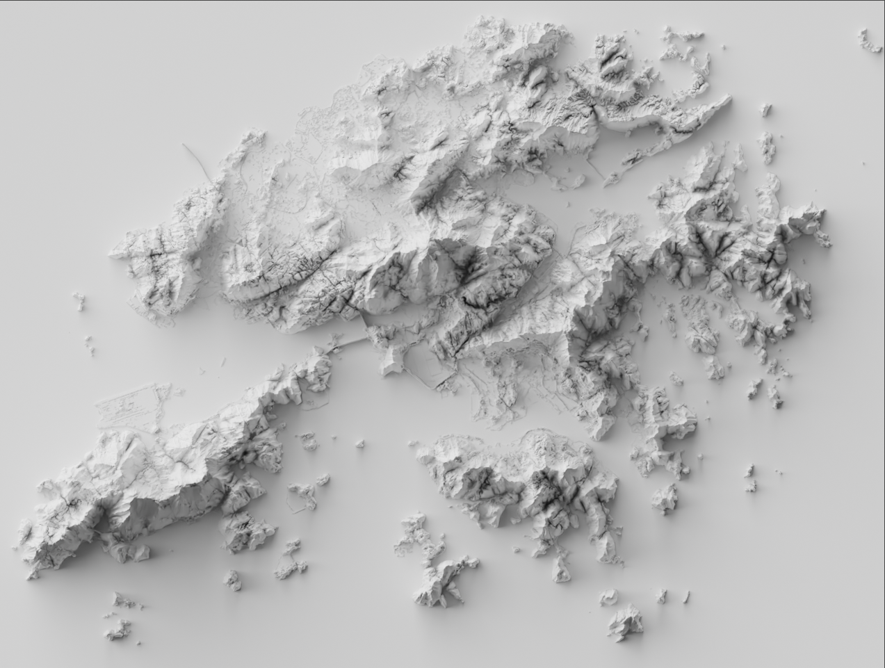

# Shaded relief maps in blender

## Intro

This guide will show you how to take [DEM/DSM/DTM](https://geodetics.com/dem-dsm-dtm-digital-elevation-models/) data and transform it into visualisation like you see below.

These visualisations created can be incredibly high resolution (100MP+), making them suitable for large format printing or other high fidelity physical productions.

I will be going through the whole process, using Hong Kong as my area of interest.

This guide builds upon the original by [Joe W Davies](https://github.com/JoeWDavies/geoblender).

 

## Requirements
For this tutorial I used the following software:  
* QGIS 3.20
	* For data wrangling of terrain data
* Blender 2.92
	* For converting the terrain data into a render
* Camera Raw 13.3 (Optional)
	* For spatial upscaling of the render output
	* Alternatively: Gigapixel AI or [free online upscalers](https://waifu2x.pro/)
* Photoshop 2021 v22.4.2
	* For compositing the final render, text, and border
	* Alternaitvely: [GIMP](https://www.gimp.org/) or [Photopea](https://www.photopea.com/)

## Table of Contents
1. [Obtain the Terrain Data](#1) 
2. [Prepare the Terrain Data](#2)
3. [Prepare the Blender Scene](#3)
	* [Scene Settings](#3a) 	
	* [Lighting Settings](#3b) 
	* [Camera Settings](#3c) 
4. [Plug the DEM into the plane](#4)
5. [Add Modifier](#5)
6. [Add Colour!](#6)
7. [Export Render to png file](#7)
8. [Add Text and Borders](#8)  

### Step 1: Obtain the Terrain Data 

 

* Download terrain data for the area of interest (AOI)
	* This can be referred to as DEM/DSM/DTM data depending on the level of data cleaning performed
	* Multiple datasets can be obtained and merged if required

 

* Low fidelity (10m) DEM data can be found at [here](https://ec.europa.eu/eurostat/web/gisco/geodata/reference-data/elevation/copernicus-dem/elevation)
	* Useful for country/continent level visualisations

 

* Medium and High fidelity data can be trickier to track down, local authority/government websites are a possible source
	* [Hong Kong 5m DTM data](https://data.gov.hk/en-data/dataset/hk-landsd-openmap-5m-grid-dtm)

 

* n.b. The resolution of your terrain data will be the upper limit of the resolution of the render

 

### Step 2: Prepare the Terrain Data 

 

* Open QGIS and load data through: Layer > Add Layer > Add Raster Layer

 

* If you need to merge multiple tiles together for your area of interest then use: Raster > Miscellaneous > Merge

 

* Now reproject the DEM into your desired projection in QGIS using Raster > Projections > Warp (Reproject)

 

* If you wish to clip the DEM to a specific area then in QGIS use Raster > Extraction > Clip Raster by Mask Layer. This uses use a polygon (Vector layer) of your area of interest as 'Mask Layer'
	* e.g. Using a [polygon of Wales](./tutorial/AOI/Wales_EPSG4326.shp) to clip the DEM data of the UK
	* Things to note before performing the transform:
		1. Convert both Vector and Raster layers to the same projection (e.g. EPSG:4326)
		2. Ensure that both layers are stored as files on your computer (Otherwise 'File not found' errors can occur)

 

* Once you have your reprojected DEM, right click it in the layers tab and select Export > Save As
	

* Then in the popup window select 'Rendered image' as the output mode. This rendered image is what we will use in Blender.
	

## Step 2.5: (Optional) Enhanced Masking for AOI
* Create a selective mask to separate colours for different types of terrain
* [Link](./optional_extras.md#Step-2.5-Enhanced-Masking-for-AOI)

## Step 3: Prepare the Blender Scene 
Please bear in mind that this will take longer the first time you do it, but once it is set up you can just reuse the project as a template and adjust the dimensions to the different DEMs

### Scene Settings 

* First delete the cube that is loaded by default (left click then delete key)

* Then we need to add a plane. This is done by selecting Add > Mesh > Plane

 

* In the right side bar navigate to 'Output Properties' and set the 'Dimensions' of the scene according to the dimensions of our DEM image (in this case, the rendered DEM is 2348 x 2604 so set the X in scene dimensions to 2348 and the Y to 2604)

 

* Also notice that the % of the scene dimensions is set to 20%. This just means that renders will be a lot quicker whilst we are tinkering with different settings until we are happy. Once everything is ready we can crank it up to 100% (or for bigger DEMs whatever our computer is capable of!) and the render will take longer but will produce an image with a higher resolution

 

* We also need to make sure that the aspect ratio of our scene matches our DEM image. To do this, we can just set the scale of our plane to match the dimensions of our DEM. In this example the DEM is 2348 x 2604 so I will set the plane X scale to 2.348 and the Y scale to 2.604

   

* Just like this % value of the scene dimensions, we can increase and decrease the 'Render' value in the 'Render Properties' tab to determine how many passes blender takes for each pixel (higher = more detailed, lower = less detailed)

   

* In the same tab, we must also set the render engine to 'cycles' and set 'feature set' to experimental. This enables blender to do its shaded-relief magic
	* If you have a GPU change the 'Device' to 'GPU Compute' reducing the amount of time required (or increasing the size of images you can process) by using [GPU rendering](https://docs.blender.org/manual/en/latest/render/cycles/gpu_rendering.html)

### Lighting Settings 

* We also need to configure the light source of our scene. We need to select sun as our light, so to do this left click the light object in the object collection (top right) then select the 'Object Data Properties' panel then select sun, set the power to 6 and the angle to 90
* If you want to exaggerate the shadows, change this angle from 90 to say 70 (or whatever you want!) just bear in mind that valleys will lose visibility as you reduce this value

   

* Now open the object properties panel (orange square icon for me) and for rotation put 0 for X, 45 for Y, and 135 for Z 

The original author chose these settings based on tutorials they followed, for a more in-depth explanation on lighting shaded relief maps in blender [check out this tutorial](https://somethingaboutmaps.wordpress.com/blender-relief-tutorial-the-sun/). Feel free to play around with these values once we've done our first render.

### Camera Settings 

Finally, we need to set our camera to how we want it. To do this, select the camera object in the object collection (top right) then set the following values:

* In the object properties panel, set the location X and Y values to 0, and the Z to 3

* Then set the rotation X Y and Z to 0

If the camera is too zoomed-in, adjust the focal length property (when using a perspective camera) or the orthographic scale (when using an orthographic camera). You can also adjust the Z position of the camera. For playing around with different camera angles try switching to the '3D viewport' editor type and moving the camera by hand (see screenshot below)

 

## Step 4: Plug the DEM into the Plane 
 * In order for the plane to use our DEM for elevation, we need to add a new material to our plane. To do this, select the plane in the object collections panel (top right), then change the editor mode to shader editor
 
 

 * Once in shader editor click 'new material' which should add two new nodes: a Principled BSDF and a Material Output

 * All we need to do is add an image texture by clicking Add > Image texture. When the node appears, click the open image button and select the DEM .tif file we prepared earlier

 * Now add a displacement node by selecting Add > Displacement

 * Click the 'color' circle of the image texture node and drag to the 'height' circle of the displacement node. Then do the same but from 'displacement' of the displacement node to 'displacement' of the material output. It should now look something like this:
 
 

* Finally, with the plane selected: go into the material properties > settings > surface and change displacement to 'displacement and bump'

## Step 5: Add Modifier 

 If you render the image now (Render > Render Image or press F12) you should get something like this:
 
 

Which is not what we want (blender is not deforming the plane 'in 3D' it is just showing a 2D hillshade)

To change this add a modifier:

* Click the blue spanner icon to open modifier properties then click Add Modifier > Subdivision Surface. Now select 'Simple' as the type of subdivision algorithm then tick 'Adaptive Subdivision'

Now press F12 to render again and you should end up with something like this:

 

## Step 6: Add Colour! 

In order to add colour we can add a colour ramp which will use our DEM to determine the colour of each pixel

* First add a colour ramp node with Add > Color ramp
	* The 'Pos' value is between 0 and 1, corresponding to the lowest and highest value in your tif
	* This slider will need to be changed per DEM file used

 

* Plug the DEM image texture node 'Color' into the 'Cac' of the color ramp node and then the 'Color' of the Color Ramp node into the 'Color' of the Principled BSDF shader node

 

* Add colour stops by using the '+' icon and click the colour to open the colour selector

 

Play around with the colours and their positions on the ramp to make change the thresholds at which colours change
* Use a lower 'Dimensions' % in 'Output Properties' to test colour choices

## Step 6.5: (Optional) Differentiate AOI from non-AOI Areas
* Use the previously created mask in 2.5 to selectively colour areas
* Use the previously created mask in 2.5 to enhance certain area's elevation
* [Link](./optional_extras.md#Step-6.5-Differentiate-AOI-from-non-AOI-Areas)

## Step 7: Export Render to png file 
* Once you are happy with your settings you can increase 'Dimensions' % in 'Output Properties' to as large as your computer allows. Hit F12 and let the image render
	* Trial and error is the best way to find this
	* On a GPU with 8GB of memory and using Blender Cycles with Optix the limit is around 6000 x 4500 images though this will vary depending on the complexity of the DEM

 

* Once complete select Image > Save As
	* For highest quality change the 'Color Depth' to 16 and the 'Compression' to 0%

## Step 7.5: Upscale the Render
* Take the output png and upscale it for higher resolutions for larger format printing
* [Free online upscalers](https://waifu2x.pro/) or other software (Photoshop, Gigapixel AI) are able to do this. Especially useful if your hardware does not allow for high resolution renders

## Step 8: Add Text and Borders 

* Bring the newly exported image into Photoshop/Photopea/Other image editor and add text/borders to suit

