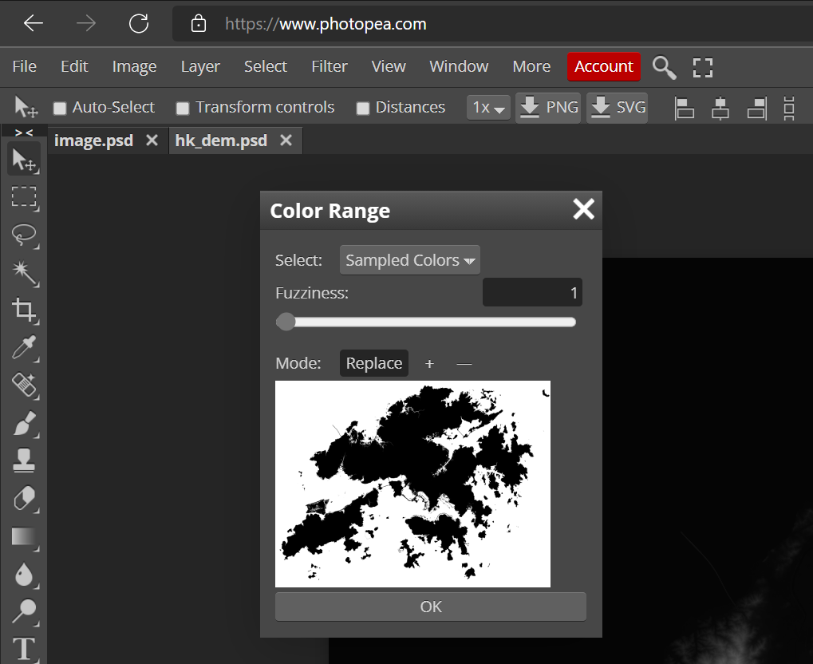

# Optional Steps from README
These steps are not necessary to for the core workflow to created shaded relief maps

/////////////////////////////////////////////////////////////////////////////////////////////////////////////////////////////

## Step 2.5 Enhanced Masking for AOI

If you are using a colour ramp with your DEM then you probably want to distinguish between features such as land and sea. This can be accomplished using a mask. Here I will briefly explain how I do this.

### 1: Rasterize vector polygon of AOI in QGIS (raster > conversion > rasterize) with the following options:
	
    input layer: your vector polygon
	value to burn: 1
	output units : pixels
	width resolution : width of final DEM tif in pixels
	height resolution : height of final DEM tif in pixels
	output extent: same extent as our final DEM tif
	no data value: -1
	output data type: byte

### 2: Save the generated raster as a rendered image (Export > Save As > Outputmode = Rendered Image)
* Saves as a tif file

### 3: Convert black areas of the tif to transparent areas in a png 
* In Photoshop/Photopea Select > Color Range > Click on black area in window > Set Fuziness to 1 > Press 'Delete'
* File > Export As > PNG > Enable Transparency

 

* In IrfanView Save As png > select black area as transparent color

### 4: Use this png later as in Step 6.5

/////////////////////////////////////////////////////////////////////////////////////////////////////////////////////////////

## Step 6.5 : Differentiate AOI from non AOI Areas
* Here is an example of using a different colour input for areas inside and outside the mask:

 

* You can also use this mask to artificially 'raise' your area of interest.
    * Use a 'Math' node connected to the DEM as the color1 input of a 'MixRGB' node and color2 as the DEM
    * Use the mask as the Fac connection of the Mix node.
    * The result of this Mix node is then plugged into the Displacement node.